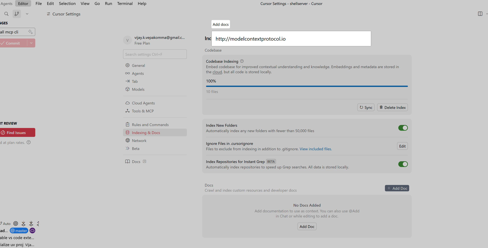
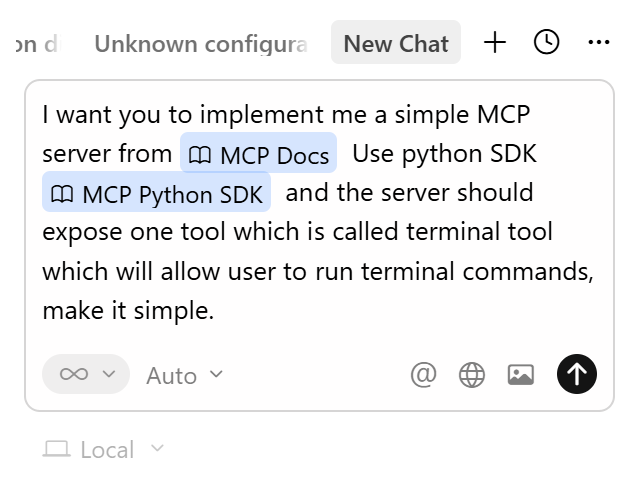

# Goal 2: Build an MCP Sever


## Resources
- [Github Repo](https://github.com/emarco177/mcp-crash-course)
- [Install UV](https://docs.astral.sh/uv/getting-started/installation/#pypi)
  - pip installl in git bash
     ```shell
        pip install uv
    ```


## Overview
- Initialize project with UV
- Create venv with UV
- Install dependencies MCP[CLI]
- Index official documentation with Cursor
- Update project with cursor rules

### Initialize Project with UV
```shell
uv init shell-server
cd mcp-server
uv venv
source .venv/Scripts/activate
uv add "mcp[cli]"
```

## Add docs to Cursor

- Go to cursor settings and add the MCP docs to index
- https://modelcontextprotocol.io 
- https://github.com/modelcontextprotocol/python-sdk



## Add rules to Cursor
- Go to [cursor.directory](https://cursor.directory)
- Search for python, fastapi, scalable API development
- Add to .cursor/python.mdc
- Run below prompt

```prompt
I want you to implement me a simple MCP server from @MCP Docs  Use python SDK @MCP Python SDK  and the server should expose one tool which is called terminal tool which will allow user to run terminal commands, make it simple.
```

