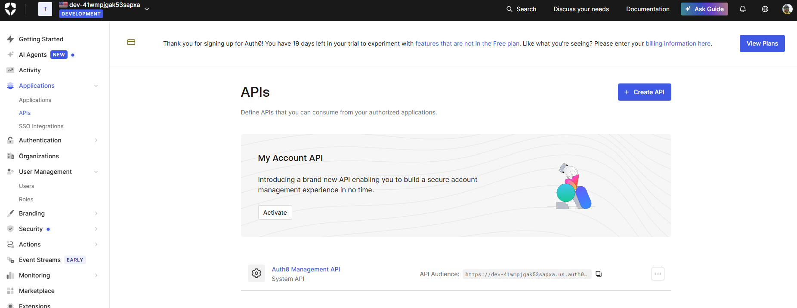
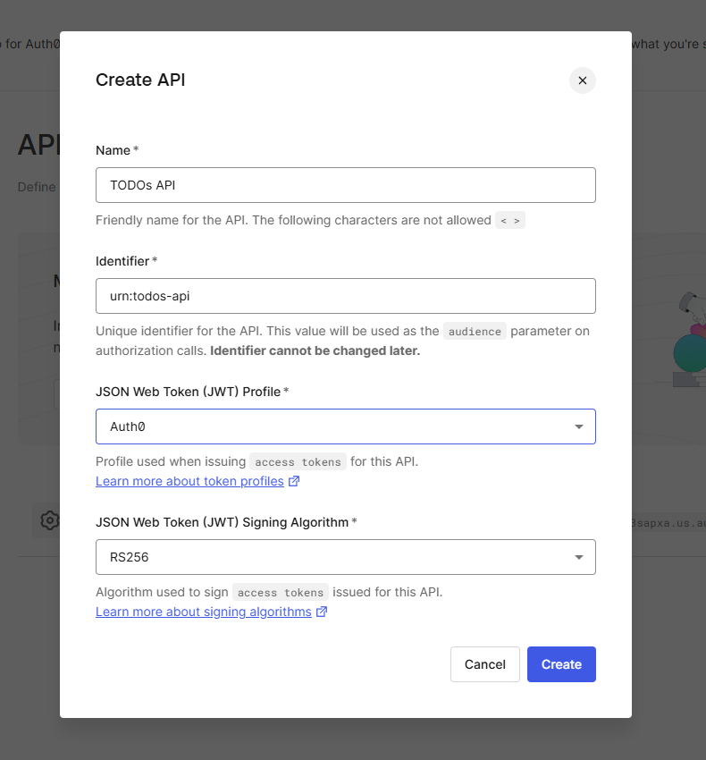
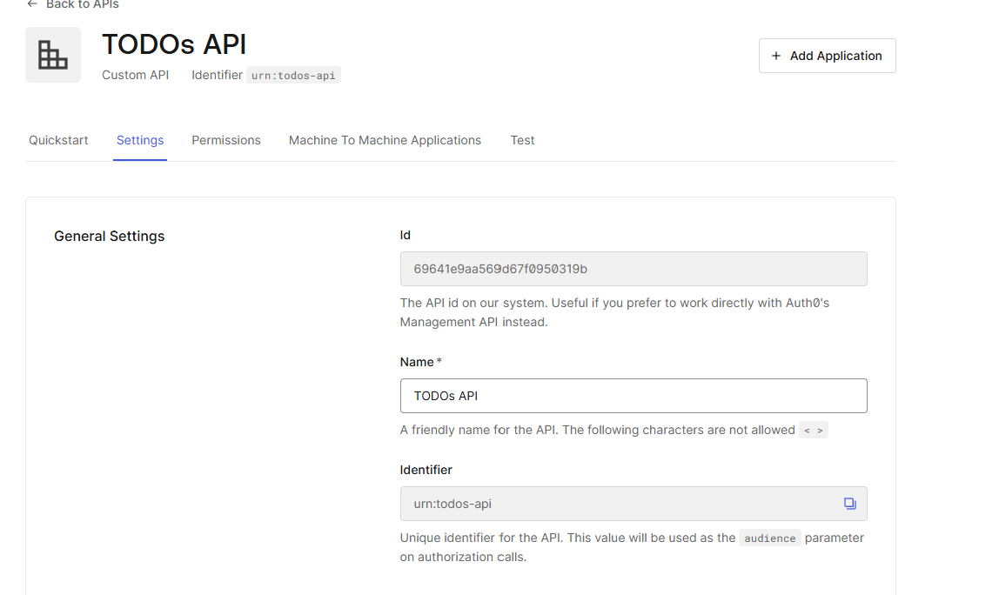
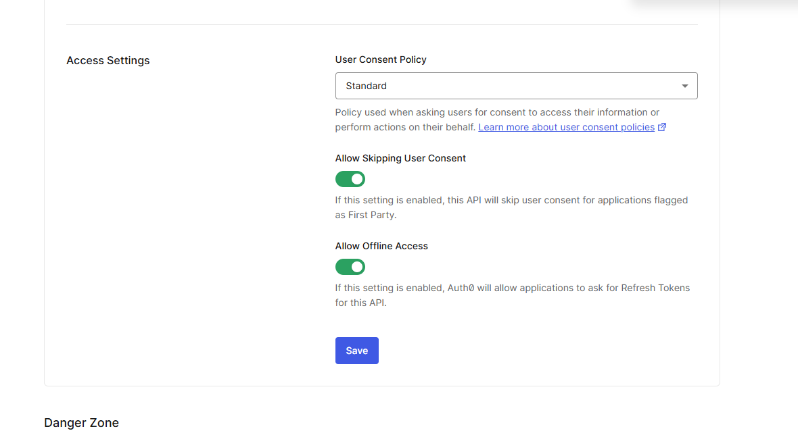
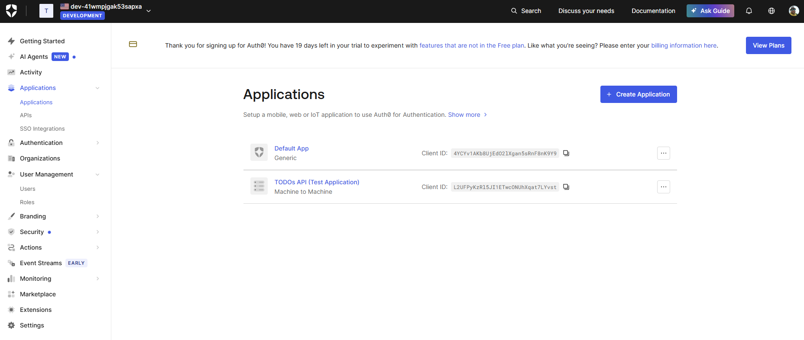
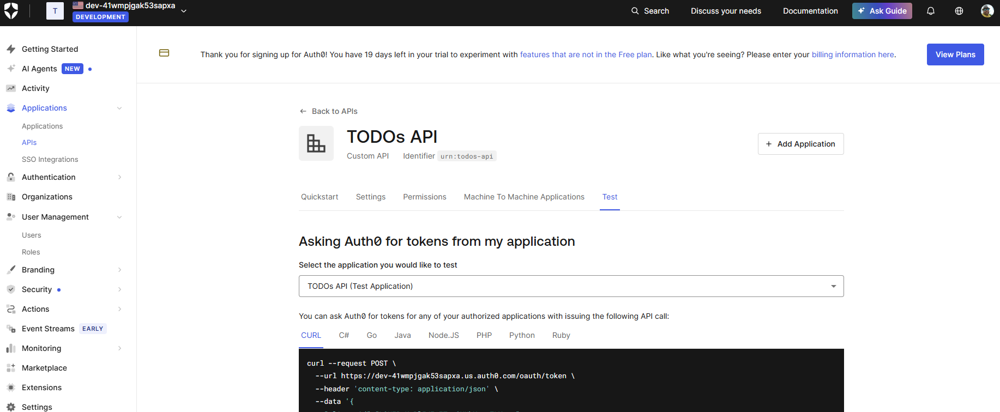

# Cloud Authenticated MCP Server

- Get [Auth0](https://auth0.com/) account
- Get [CloudFlare](https://www.cloudflare.com/) account
- Install [Cloudflare Wrangler](https://developers.cloudflare.com/workers/wrangler/install-and-update/)
- Make sure git and node are available
- Clone [Cloudflare AI](https://github.com/cloudflare/ai) repo, go to demos folder
  - [Remote MCP Auth0](https://github.com/cloudflare/ai/tree/main/demos/remote-mcp-auth0) demo

## Arch Workflow 
- MCP Server is the OAuth Server for our MCP Client
- It issues access and refresh tokens
- MCP Server is the OAuth Client for Auth0 server
- It is OIDC client for the Auth0 server
- MCP Client thinks it is token provider

## Run Auth0 Demo
- cd todos-api
- npm install
- npm run dev
- It runs at port - [http://127.0.0.1:8789](http://127.0.0.1:8789)
- It will get error - requires auth0 domain, we need to setup auth0 project

## Auth 0 Setup
- Applications -> Apis -> Create API  


  - name: todos-api
  - identifier: urn:todos-api



- Quick Start - Nodejs - check code snippet
- [Original Instructions](https://github.com/cloudflare/ai/blob/main/demos/remote-mcp-auth0/todos-api/README.md)
### Settings
- Settings - allow offline access





### Permissions

Add below API permissions
- `read:todos`
-  `read:billing`

### Configure the App

- Add `.dev.vars`
```dotenv
AUTH0_DOMAIN=yourtenant.us.auth0.com
AUTH0_AUDIENCE=urn:todos-api
```

- Go to Applications, Todos API



- Copy the domain and update AUTH0_DOMAIN

- Run the app. It should show "Unauthorized"

### Test the App
- Go to APIs
- TODOs API, Copy the CURL




- Run [CheckMe.sh](todos-api/test/CheckMe.sh)

```json
{
  "iss": "https://<YOUR>.us.auth0.com/",
  "sub": "<YOUR_SUB>",
  "aud": "urn:todos-api",
  "iat": 1768171433,
  "exp": 1768257833,
  "gty": "client-credentials",
  "azp": "<YOUR_AZP>"
}

```