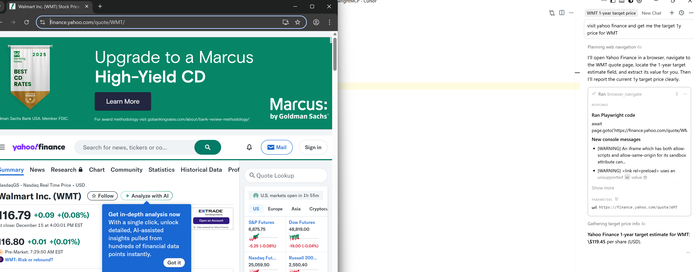

# Playwright MCP

## Resources 
- [Playwright MCP GitHub Repository](https://github.com/microsoft/playwright-mcp)

## Cursor Integration
- In `.cursor/mcp.json` add the following
```json
{
  "mcpServers": {
    "playwright": {
      "command": "npx",
      "args": [
        "@playwright/mcp@latest"
      ]
    }
  }
}
```

## Test in Cursor

```prompt
visit yahoo finance and get me the target 1y price for WMT
```

